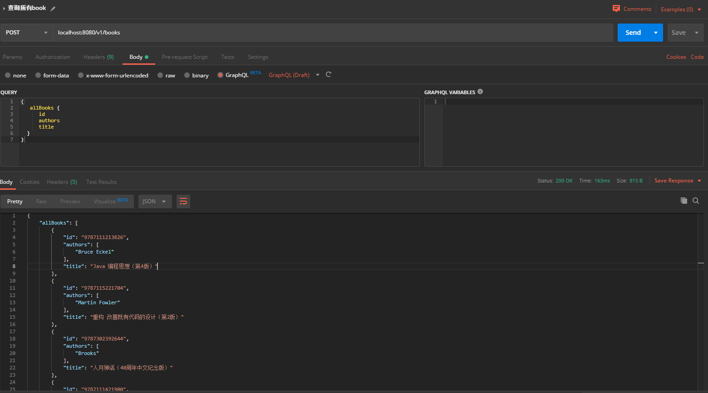

# SpringBoot-GraphQL

通过 `springboot` 与 `java-graphql` 构建`graphql`服务端案例.

构建依赖:

* Springboot
* graphql(graphql-spring-boot-start)

> [graphql java code官网](https://graphql.org/code/#java)

## START

#### 1. 启动后台

run com.dxp.graphql.com.dxp.mybatis.Application.java 中的main函数即可

#### 2. 测试

该模块下有一个 `api` 文件夹， 下面有已经写好的案例 `book.http`



## 核心

### 1.定义 Schema

在resource下定义自己的 `graphql`,语法参照官网构建即可.       
[graphql官网](https://graphql.org/)

### 2.定义DataFetcher

DataFetcher 接口中只定义了一个方法.  可参考 `BookDataFetcher.java` 和 `AllBooksDataFetcher.java`
```dtd
    /**
     * This is called by the graphql engine to fetch the value.  The {@link graphql.schema.DataFetchingEnvironment} is a composite
     * context object that tells you all you need to know about who to fetch a data value in graphql type terms.
     *
     * @param environment this is the data fetching environment which contains all the context you need to fetch a value
     *
     * @return a value of type T
     */
    T get(DataFetchingEnvironment environment);
```
`DataFetchingEnvironment` 即为调用者传过来的参数

### 3.构建 GraphQL